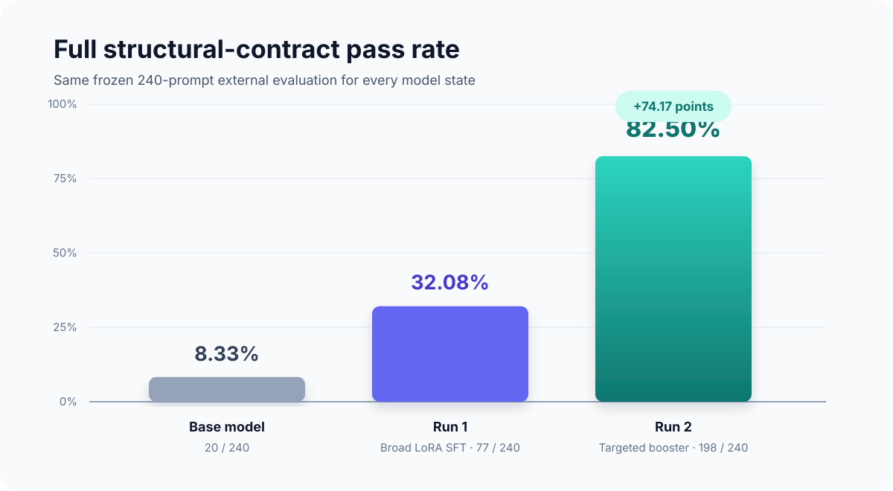
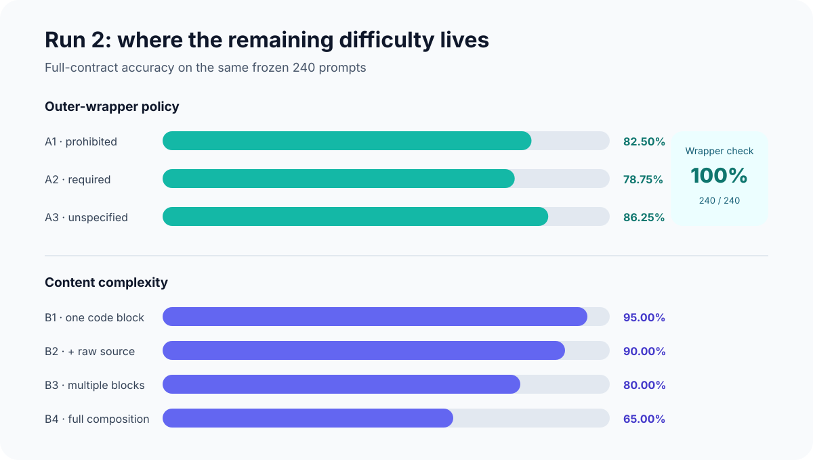

# Reliable Markdown Generation with Local LoRA SFT

[](LICENSE)
[](https://github.com/ml-explore/mlx-lm)
[](https://huggingface.co/logicless/qwen25-coder-3b-markdown-reliability-lora-mlx)

This experiment tests whether supervised LoRA post-training can make a small
code model obey difficult Markdown structure requirements more reliably. It is
designed to run locally with MLX-LM on Apple Silicon.

## Experimental contract

- Base model: `mlx-community/Qwen2.5-Coder-3B-Instruct-4bit` at revision
  `3dd939c621c08e5753d5b89f35a2642cd83b98ca`.
- Training budget: up to one epoch of assistant-only-loss LoRA SFT with 5,000
  generated, programmatically verified examples. The selected run was
  early-stopped at iteration 500 after training and validation loss converged.
- Internal validation: 500 examples from 40 task families never present in
  training.
- External evaluation: the same frozen 240-prompt LatentMD subset, prompt text,
  chat template, generation settings, and local evaluator before and after SFT.
- Primary metric: full structural-contract pass rate. This is not an assessment
  of the semantic correctness of the programming solution.
- No LatentMD prompt or model response is used as a training target.

The base model scored **20/240 (8.33%)**. Broad Run 1 SFT reached **77/240
(32.08%)**. The targeted Run 2 wrapper correction reached **198/240 (82.50%)**
on the same frozen external prompts: a 74.17-point absolute gain and a 9.9x
relative improvement over the base model.



Read the full methodology, failure analysis, and Run 2 design in
[`REPORT.md`](REPORT.md). Download the final standalone adapter from
[Hugging Face](https://huggingface.co/logicless/qwen25-coder-3b-markdown-reliability-lora-mlx).

| Metric | Base | Run 1 | Run 2 |
| --- | ---: | ---: | ---: |
| Full structural contract | 8.33% | 32.08% | **82.50%** |
| Balanced fences | 92.08% | 97.08% | **97.50%** |
| Language code examples | 26.67% | 64.17% | **87.92%** |
| Raw Markdown source | 65.42% | 79.17% | **93.33%** |
| Cited blockquote | 77.50% | 91.67% | **95.00%** |
| Outer-wrapper policy | 38.33% | 66.67% | **100.00%** |

Run 1 revealed a concentrated failure: all 80 A2 prompts requiring an outer
`markdown` fence failed because the adapter began directly with document
content. This illustrated why low teacher-forced validation loss does not by
itself prove sequence-level instruction compliance: a wrong choice in the first
generated tokens can fail the entire wrapper contract while contributing very
little to average token loss. Run 2 corrected this behavior: all 240 external
responses satisfied their A1/A2/A3 outer-wrapper policy, while A2 full-contract
accuracy rose from 0/80 to 63/80.



## Run 2: targeted wrapper correction

Run 2 preserved the first adapter and continued from it using a separate
600-example contrastive booster. The booster contains 360 A2 examples, 120 A1
controls, and 120 A3 controls; B1–B4 each receive 150 examples. It includes
120 matched A1/A2 pairs where the content is identical and only the wrapper
instruction and correct output differ. Eighty percent of the corpus uses direct
generation with the exact LatentMD instruction wording.

Targets were deliberately short so the opening and closing wrapper tokens
contribute more strongly to token loss. The 120-example internal validation set
uses disjoint task families and direct-generation prompts only. Run 2 uses a
`2e-6` learning rate, 300 micro-batches, saves every 50 iterations, and retains
Run 1 under its original adapter path.

```zsh
../.venv/bin/python scripts/generate_wrapper_booster.py
../.venv/bin/python scripts/validate_dataset.py \
  data/processed/wrapper_booster/train.jsonl \
  data/processed/wrapper_booster/valid.jsonl

../.venv/bin/python scripts/train_lora.py \
  --config configs/lora_wrapper_booster.yaml
```

The internal generated pass rate improved from **29/120 (24.17%)** with Run 1
to **116/120 (96.67%)** with Run 2, including an A2 improvement from 0/72 to
70/72. The selected iteration-300 checkpoint then achieved 198/240 on the
frozen external set. Exact metrics are stored under `results/`.

## What makes the task difficult

The corpus covers a balanced 3 x 4 contract grid:

| Axis | Requirement |
| --- | --- |
| A1 | Return the Markdown document directly; prohibit an outer wrapper. |
| A2 | Wrap the whole document in a four-backtick `markdown` fence. |
| A3 | Leave outer wrapping unspecified. |
| B1 | Exactly one language-specific fenced code example. |
| B2 | A code example plus its visible raw Markdown fence source. |
| B3 | Multiple code examples plus multiple raw-source blocks. |
| B4 | Multiple code examples, a table, a cited blockquote, and a numbered list. |

The 12 A x B cells receive 416 or 417 training examples each and 41 or 42
validation examples each.

## Where the training data comes from

The 200 underlying programming-task families come from the original
[MBPP dataset](https://huggingface.co/datasets/google-research-datasets/mbpp)
and eight MBPP language configurations in
[MultiPL-E](https://huggingface.co/datasets/nuprl/MultiPL-E): C++, Java,
JavaScript, Go, Rust, Ruby, Shell, and TypeScript. Exact source revisions and
licenses are recorded in `configs/experiment.yaml` and `THIRD_PARTY_DATA.md`.

The split is made by the underlying MBPP task ID before Markdown examples are
rendered:

- 160 task families for training;
- 40 disjoint task families for internal validation;
- zero exact task or target overlap between the two splits.

Each target is built by deterministic Python code and rejected unless the
structural evaluator accepts every requested constraint. The final mixture is:

- 3,000 direct generation examples;
- 1,500 malformed-Markdown repair examples;
- 500 JSON-to-Markdown transformation examples.

The 500-example validation set uses the same 60/30/10 mixture. All 5,500
targets are unique and verifier-passing. See `results/final_sft_manifest.json`.

## Reproduce the data

From this directory, using the parent project's existing Python environment:

```zsh
../.venv/bin/python scripts/prepare_content_plans.py
../.venv/bin/python scripts/generate_sft_dataset.py
../.venv/bin/python scripts/validate_dataset.py \
  data/processed/final/train.jsonl \
  data/processed/final/valid.jsonl
../.venv/bin/python scripts/audit_token_lengths.py
../.venv/bin/python -m unittest discover -s tests -v
```

The token audit measured a maximum of 3,105 tokens in training and 2,518 in
validation, so the configured 4,096-token training limit truncates zero records.
Generated datasets are ignored by Git and can be rebuilt from pinned sources.

## Frozen baseline

Prepare the external subset, generate with the base model, and score it:

```zsh
../.venv/bin/python scripts/prepare_latentmd.py

../.venv/bin/python scripts/generate_eval.py \
  --dataset data/latentmd/eval_240.jsonl \
  --output outputs/latentmd_baseline_predictions.jsonl

../.venv/bin/python scripts/score_latentmd.py \
  outputs/latentmd_baseline_predictions.jsonl \
  --summary results/baseline_metrics.json
```

`score_latentmd.py` is a transparent local evaluator written for this project.
It checks outer-wrapper policy, fence balance, language-specific code examples,
raw Markdown source, tables, cited blockquotes, and numbered lists. It is not
the LatentMD authors' official evaluator and does not judge arbitrary prose or
code semantics.

## Train the LoRA adapter

The selected training configuration uses all 36 transformer blocks, rank 16,
learning rate `1e-5`, batch size 2, four-step gradient accumulation, prompt
masking, and 500 micro-batches. This is 1,000 example presentations and 125
optimizer updates. The original ceiling was 2,500 micro-batches (one epoch),
but training loss had reached approximately zero and sampled validation loss
fell from `0.630` to approximately zero by iteration 250. The first complete
saved checkpoint at iteration 500 was therefore selected before further
repetition. Exact run metadata is in `results/training_summary.json`.

```zsh
../.venv/bin/python scripts/train_lora.py
```

The wrapper requires baseline metrics, resolves the exact cached model revision,
runs MLX-LM, and then keeps the full generated `adapter_config.json` while
replacing machine-local paths with portable repository paths.

## Repeat the external evaluation with the adapter

```zsh
../.venv/bin/python scripts/generate_eval.py \
  --dataset data/latentmd/eval_240.jsonl \
  --adapter-path adapters/qwen25-coder-3b-markdown-reliability-lora \
  --output outputs/latentmd_adapter_predictions.jsonl

../.venv/bin/python scripts/score_latentmd.py \
  outputs/latentmd_adapter_predictions.jsonl \
  --summary results/adapter_metrics.json
```

The completed post-training comparison uses the same 240 prompts and frozen
generation settings in `configs/experiment.yaml`. Compact base, adapter, and
comparison results are stored under `results/`.

## Project layout

```text
configs/                  frozen experiment and LoRA settings
data/processed/           regenerated content plans and SFT JSONL (Git-ignored)
data/latentmd/            frozen external prompt subset (Git-ignored)
outputs/                  model responses and detailed scores (Git-ignored)
results/                  compact manifests and publishable metrics
scripts/                  preparation, audit, training, generation, and scoring
src/markdown_reliability/ renderers, generators, and evaluators
tests/                    structural and corruption-detection tests
```

## Limitations

The experiment isolates Markdown-format reliability. The generated documents
describe supplied programming interfaces and test harnesses; they intentionally
do not train the model to solve those programming problems. Parser-valid
Markdown can still contain weak prose or incorrect technical claims, so the
reported pass rate should not be interpreted as general answer quality.

The 240-prompt result is a controlled portfolio experiment rather than a
comprehensive Markdown benchmark. The local evaluator is project-specific, and
the model and adapter are optimized for MLX-LM on Apple Silicon.

## Repository artifacts

- [`REPORT.md`](REPORT.md): portfolio report and experiment interpretation.
- [`results/final_comparison.json`](results/final_comparison.json): compact,
  machine-readable baseline/Run 1/Run 2 comparison.
- [`configs/lora.yaml`](configs/lora.yaml): broad Run 1 training configuration.
- [`configs/lora_wrapper_booster.yaml`](configs/lora_wrapper_booster.yaml):
  targeted Run 2 configuration.
- [`publish/huggingface/README.md`](publish/huggingface/README.md): model card
  published with the adapter.
- [`PUBLISHING.md`](PUBLISHING.md): safe, allowlisted publication workflow.

## License

The project code is released under the [MIT License](LICENSE). Third-party data
retains its original licensing; see [`THIRD_PARTY_DATA.md`](THIRD_PARTY_DATA.md).
